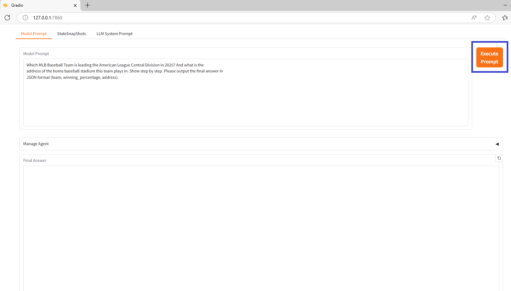

# AIAgentGooglePlaces

Create a basic agent to call external tools for search and google places

# Purpose

To answer prompts that require current information that may not be in the foundational model.

# Features

Gradio UI component to control the agent  
Langchain  
Uses gemini-2.0-flash LLM from Google  
Uses SerpAPIWrapper to call search to augment LLM  
Uses GooglePlacesAPIWrapper to call Google Places API to get addresses  

# Installation

Create PYCharm AIAgentGooglePlaces project locally in a chosen virtual environment  
Add dependencies to virtual environment as described in requirements.txt  
Add in src files main.py, GooglePlacesAgent.py  
Modify GooglePlacesAgent.py to update your GOOGLE API, SERPAPI API, and GPLACES API keys.  

# Usage

Run main.py from PYCharm project  
  
System will create a local URL "* Running on local URL:  http://127.0.0.1:7860"  
Click on link to instance the Gradio UI in your default browser  
Click Execute Prompt button to run the agent to create the final answer  
  
System displays final answer that requires use of an external internet search tool and a google places tool  
  

